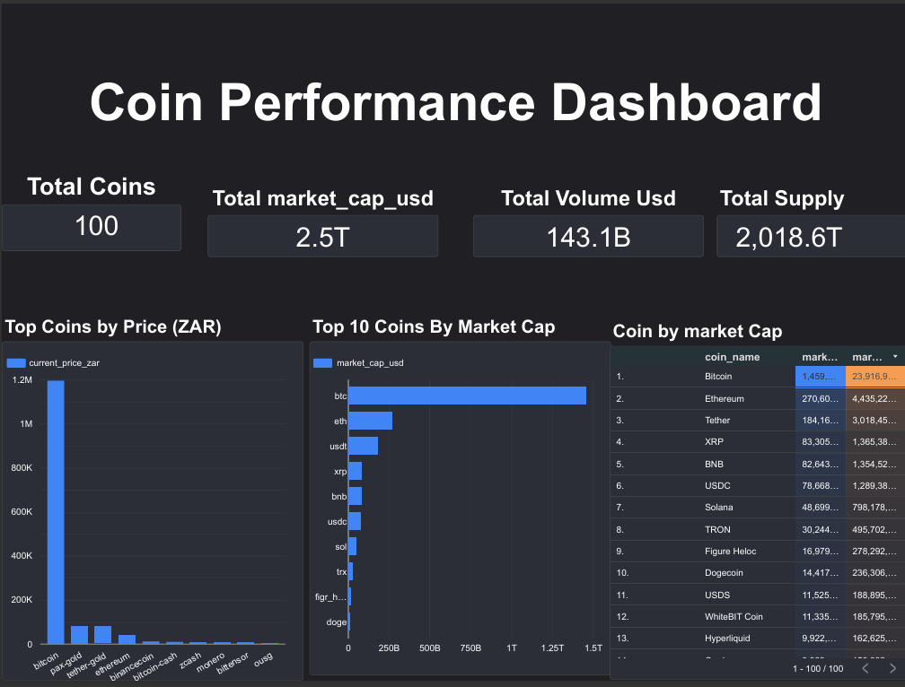
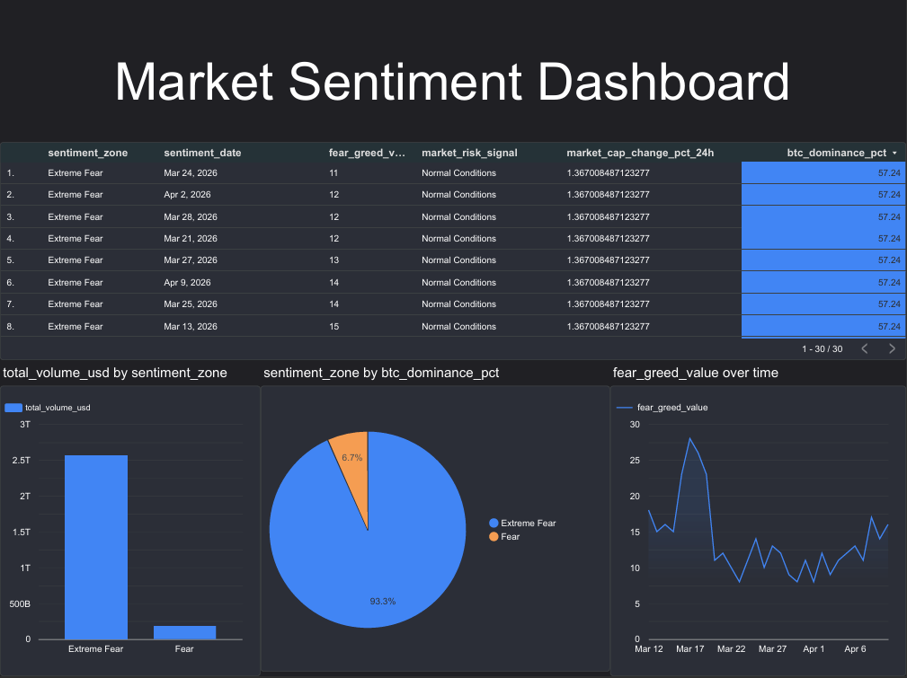
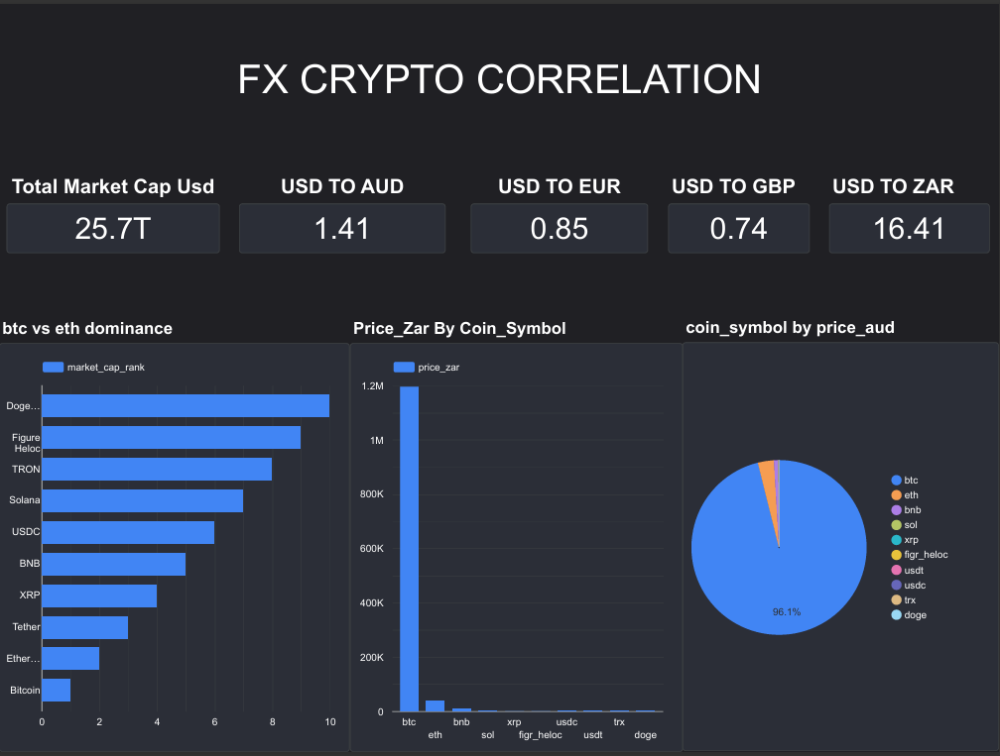

# Crypto Market Analytics Pipeline

A production-style, multi-source analytics pipeline built with Python, BigQuery, dbt, and Looker Studio. This project ingests live data from 4 external APIs, transforms it through a governed dbt layer, validates it with automated tests, and delivers business insights through a 3-page executive dashboard.

**Live Dashboard:** https://lookerstudio.google.com/reporting/5b2423b8-a2c7-44b6-8aa1-62b36d16311d

**Author:** Proud Kudzai Ndlovu — Analytics Engineer | dbt · BigQuery · SQL · Python

---

## The Business Problem

Crypto markets generate data across disconnected sources — price feeds, sentiment indices, currency markets, and macro indicators. Without a unified data layer, analysts manually reconcile spreadsheets, make decisions on stale numbers, and build reports that break the moment a source changes.

This pipeline solves that by building a single source of truth. Raw data lands once, gets cleaned once, and delivers trusted insights automatically — the same architecture that powers data teams at scale.

---

## Architecture

```
4 External APIs
      │
      ▼
Python Ingestion Script (ingestion/ingest.py)
      │
      ▼
BigQuery Raw Layer — 4 tables, full fidelity, timestamped
      │
      ▼
dbt Staging Layer — clean, type, rename, document
      │
      ▼
dbt Mart Layer — business logic, joins, enrichment
      │
      ▼
dbt Test Suite — not_null, unique, accepted_values
      │
      ▼
Looker Studio Dashboard — 3 pages, live, interactive
      │
      ▼
GitHub Actions — daily schedule, fully automated
```
---
## Production Applicability

This pipeline follows the same architecture used in production 
analytics engineering teams. The 4 crypto APIs can be swapped 
for any business data sources — Shopify (orders), Stripe 
(payments), Segment (events), Salesforce (CRM) — and the 
ingestion, staging, mart, and test patterns remain identical. 
The crypto domain is the demo. The architecture is the product.

---

## Data Sources

| Source | API | What It Delivers |
|--------|-----|-----------------|
| Top 100 Coins | CoinGecko | Price, volume, market cap, 24h change, ATH/ATL |
| Global Market | CoinGecko | Total market cap, BTC/ETH dominance, active coins |
| Fear & Greed Index | Alternative.me | 30-day daily sentiment score and classification |
| FX Exchange Rates | ExchangeRate-API | USD to ZAR, GBP, EUR, AUD live rates |

---

## Tech Stack

- **Ingestion:** Python, pandas, google-cloud-bigquery
- **Warehouse:** Google BigQuery
- **Transformation:** dbt Cloud
- **Testing:** dbt generic tests
- **Dashboard:** Looker Studio
- **Version Control:** GitHub
- **Automation:** GitHub Actions (daily 6am UTC)

---
## Automation

Pipeline runs daily at 6am UTC via GitHub Actions with zero 
manual intervention:

- Ingestion script pulls from all 4 APIs → overwrites BigQuery 
  raw tables
- dbt build rebuilds all staging and mart models
- Full dbt test suite runs automatically
- Looker Studio dashboard refreshes live

This replaces what most teams handle with fragile Zapier 
workflows or manual scripts. The `.github/workflows/` folder 
contains the full workflow config.

---
## Pipeline Structure

### Raw Layer

Four tables land in BigQuery exactly as received — no transformation, full fidelity, with ingested_at timestamp on every row for auditability.

### Staging Layer

```
models/staging/
├── stg_coingecko_markets.sql
├── stg_fear_greed_index.sql
├── stg_exchange_rates.sql
└── stg_global_market.sql
```

Staging has one job — make data trustworthy. Explicit type casting, unambiguous column naming, Unix timestamp conversion, NULL handling, and audit trail. No business logic. Fix it once upstream, every downstream model inherits clean data automatically.

### Mart Layer

```
models/marts/
├── mart_coin_performance.sql
├── mart_market_sentiment.sql
└── mart_fx_crypto_correlation.sql
```

Business logic lives here — cross-currency pricing, sentiment classification, market risk signals, and multi-source joins.

### Test Suite

Every model has automated tests. During development the test layer caught a real issue — BTC was returning NULL from the exchange rate API (unsupported on the free tier). Fixed at ingestion, clean data reloaded, all tests passed. The system worked exactly as designed.

A second issue emerged during dashboard validation — FX scorecards were summing rates across 10 mart rows instead of averaging, producing a USD/ZAR rate of 163.9 instead of 16.41. Caught through visual validation, fixed by correcting the aggregation. This highlights that schema tests catch NULLs and type errors — but business logic validation requires human eyes on the output. Both layers of quality control matter.

---

## Dashboard Preview

### Coin Performance Dashboard


### Market Sentiment Dashboard


### FX Crypto Correlation


---

## Key Business Insights

### 1. The market has been in Extreme Fear for 93% of the last 30 days

Between March 12 and April 11 2026, 28 out of 30 days registered Extreme Fear on the Fear and Greed Index, with values ranging from 11 to 30. This is not a short-term dip — it is sustained, structural fear. Historically, prolonged Extreme Fear periods either precede recovery as weak hands exit, or signal deeper macro deterioration. The data alone cannot tell you which. But it tells you the market is not neutral.

### 2. Bitcoin dominance is locked at 57.24% — capital is consolidating

BTC dominance held at 57.24% consistently across the entire 30-day period. This is a classic risk-off rotation — investors exiting altcoins and consolidating into Bitcoin as a relative safe haven within crypto. When dominance stays flat at elevated levels during fear, it suggests the market is not in freefall but in consolidation. Altcoin recovery typically follows BTC stabilisation.

### 3. $143.1B in daily volume during Extreme Fear — this is not a dead market

High volume during fear periods is a capitulation signal. Weak holders are selling, stronger hands are absorbing. A dead market has low volume and low sentiment. This market has low sentiment but significant volume — which is a more interesting signal than either metric alone.

### 4. Bitcoin costs R1.2M in South African Rand — currency risk compounds crypto risk

At a USD/ZAR rate of 16.41, Bitcoin priced at approximately $98,000 USD translates to R1.2M. South African investors face compounded volatility — a 10% BTC drop combined with a 3% ZAR weakening produces a 13% loss in rand terms without any change in global sentiment. The FX layer in this pipeline makes that dual exposure visible in a single dashboard.

### 5. Total market cap at $2.5T with BTC holding $1.459T — 58% concentration

Bitcoin alone holds 58% of the total tracked market cap. Ethereum at $270B is a distant second. The top 3 coins — BTC, ETH, and Tether — account for over 75% of total market cap. This level of concentration means BTC price action drives the entire market, not the other way around.

---

## Recommendations

**For crypto investors:** Sustained Extreme Fear with high volume and stable BTC dominance historically precedes recovery. Dollar-cost averaging into BTC during this window has produced strong long-term returns. But ZAR/USD exposure must be factored into position sizing — currency weakness amplifies downside in rand terms.

**For data teams:** The two quality issues caught during this build — a NULL from an unsupported API currency and a wrong aggregation in the BI layer — demonstrate why data quality requires both automated testing and human validation. dbt tests catch structural issues. Dashboard review catches logical issues. Neither replaces the other.

---

## How to Run

### Ingestion

```bash
pip install google-cloud-bigquery pandas requests pyarrow
export GOOGLE_APPLICATION_CREDENTIALS=/path/to/key.json
python ingestion/ingest.py
```

### dbt

```bash
dbt build
dbt test
dbt run
dbt build --select stg_exchange_rates mart_fx_crypto_correlation
```

---

## Project Structure

```
coingecko-analytics-pipeline/
├── .github/workflows/
│   └── daily_ingestion.yml
├── ingestion/
│   └── ingest.py
├── images/
│   ├── Coin_Performance_Dashboard.png
│   ├── Market_Sentiment_Dashboard.png
│   └── FX_Crypto_Correlation.png
├── models/
│   ├── staging/
│   │   ├── sources.yml
│   │   ├── schema.yml
│   │   ├── stg_coingecko_markets.sql
│   │   ├── stg_fear_greed_index.sql
│   │   ├── stg_exchange_rates.sql
│   │   └── stg_global_market.sql
│   └── marts/
│       ├── schema.yml
│       ├── mart_coin_performance.sql
│       ├── mart_market_sentiment.sql
│       └── mart_fx_crypto_correlation.sql
├── tests/
├── dbt_project.yml
└── README.md
```

---

*Built by Proud Kudzai Ndlovu — April 2026*
*[LinkedIn](https://linkedin.com/in/proud-ndlovu-89070854) · [GitHub](https://github.com/ApostolicDA)*
